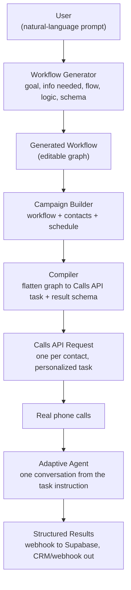
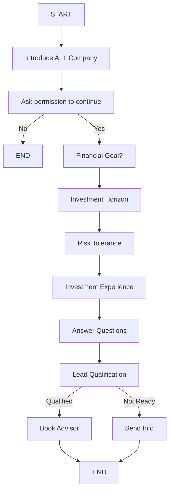
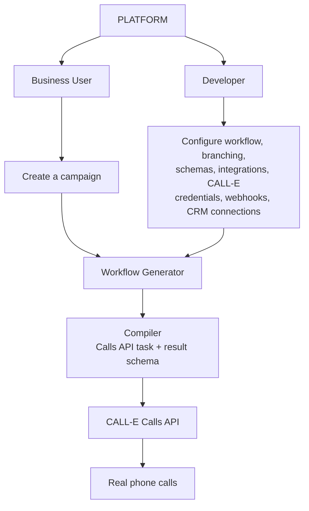

# Veyra

### Workflow Engine for CALL-E Voice Agent Swarms

---

## Elevator Pitch

You describe the outbound calling process you want and Veyra turns it into an executable phone workflow, complete with conversation logic, qualification rules, and structured outcomes, then CALL-E's voice agents run it at scale on real calls.

## Positioning Statement

"We help businesses turn any outbound calling process into an executable AI workflow. Describe what the agent needs to accomplish, our platform generates the conversation flow, qualification logic and structured outputs, and CALL-E handles the actual calls."

What could be an alternate framing for a developer customer base:
"A development and orchestration layer for building production phone-call workflows with CALL-E."

## The Problem

Businesses that rely on high-volume, repetitive outbound calling (sales qualification, appointment confirmation, renewal reminders, student counseling signups) either hire large calling teams to run scripts manually, or need engineers to hand build voice agent logic for every new campaign. Both are slow and do not scale well:

- Manual call teams are expensive, inconsistent, and hard to scale up or down quickly.
- Hand built voice agents require an AI engineer to translate a business process into prompts, conversation states, and branching logic, then rebuild it every time the process changes.

There is no fast path from "here is the business process in plain English" to "here is a working, structured, production ready voice agent."

## The Solution

Veyra is a workflow generation and orchestration layer on top of CALL-E. A business user describes their desired call process in natural language. The platform generates a structured, editable conversation workflow (nodes, branching logic, qualification scoring, data capture) and compiles it into a Calls API task and result schema. A developer can then refine the generated workflow, connect it to a contact list or CRM, and launch it as a live campaign that CALL-E executes over real phone calls, returning structured, usable results.

The workflow graph is Veyra's own authoring and editing abstraction. CALL-E does not execute an external branching graph, it runs one adaptive conversation from a single task instruction and extracts structured data at the end of the call, so the graph is flattened at compile time into a natural-language task plus a result schema.

## Implementation Status

The repository is being delivered in phases. **Phases 1 through 4 are implemented.** Phase 1
provides an authenticated, one-contact CALL-E execution boundary with strict E.164
validation, an exact masked preview, explicit approval, a content-bound idempotency key,
a fake-by-default adapter, and guarded live mode. Phase 2 connects the editable workflow
to the Python compiler, persists the compiled campaign and first contact under Supabase
RLS, reloads that campaign, and recompiles contact edits before every preview. The
credential-free `pnpm demo` places zero real calls. Phase 3 persists and compiles up to ten
contacts, binds one approval to the exact personalized batch, reserves durable call runs,
submits every run once without automatic retries, processes deduplicated terminal CALL-E
webhooks, and displays structured results and transcripts. See `web/README.md` for the
runbook. Phase 4 adds approval-bound Indian English (`en-IN`) and US English locale setup,
optional durable scheduling through a secured server dispatcher, authenticated CSV result
export, a web-to-engine health endpoint, and a Render Blueprint. Precise Vercel scheduling
requires a plan that supports frequent Cron Jobs; immediate launch remains the default.

The repository now contains the complete deployable path. A real authorized call and the
public demo recording are operational submission proof and cannot be produced by a
credential-free repository test.

## System Architecture



## Example Generated Workflow (Wealth Management Lead Qualification)

Prompt given to the platform:
"Call people who requested information about our wealth management services, understand their financial goals, risk tolerance and investment horizon, answer basic questions, qualify them, and book an advisor consultation for qualified leads."

Generated flow:



Generated workflow summary shown to the user:

| Node               | Purpose                          |
| ------------------ | -------------------------------- |
| Introduction       | Establish identity and purpose   |
| Consent            | Confirm willingness to talk      |
| Financial Goals    | Understand primary objective     |
| Investment Horizon | Determine time horizon           |
| Risk Profile       | Understand risk tolerance        |
| Experience         | Determine investment familiarity |
| Questions          | Answer basic questions           |
| Qualification      | Score the lead                   |
| Conversion         | Offer advisor consultation       |
| Completion         | Capture outcome                  |

### What this compiles into

The graph above is not sent to CALL-E. At compile time it is flattened into a single Calls API request, one per contact:

```jsonc
{
  "task": "You are Ava calling on behalf of Northbridge Wealth. Introduce yourself as an AI assistant and reference the wealth management information Marta Reyes requested. Ask permission to continue; if they decline, offer to send information by email and end politely. If they agree, ask about their financial goal (retirement, wealth growth, tax planning, education, other), then their investment horizon, then their risk tolerance. Answer basic questions about the service, but never give financial advice. If they qualify, offer to book an advisor consultation. If they are not ready, offer to send information.",
  "result_schema": {
    "type": "object",
    "additionalProperties": false,
    "required": ["qualified", "primary_goal"],
    "properties": {
      "qualified": { "type": "boolean", "description": "Met the advisor threshold" },
      "primary_goal": { "type": "string", "enum": ["retirement", "wealth_growth", "tax_planning", "education", "other"] },
      "horizon_years": { "type": "number" },
      "risk_profile": { "type": "string", "enum": ["cautious", "balanced", "growth"] },
      "slot_booked": { "type": "boolean" },
      "next_step": { "type": "string", "enum": ["book_advisor", "send_info", "retry", "do_not_contact"] }
    }
  },
  "metadata": { "campaignId": "c_2f91", "contactId": "ct_88a3" },
  "webhook_url": "https://veyra.app/api/calle/webhook"
}
```

Sent with header `Idempotency-Key: veyra_c_2f91_ct_88a3`, so a retry after a timeout can never place a second real phone call.

The key product moment: a developer can then say "add a question about approximate investable assets after risk tolerance," and the platform updates the workflow accordingly, without hand editing prompts or state machines. This is the strongest demonstration of the platform being a real devtool rather than a wrapper.

## Two Users, One Platform



- **Business user**: describes intent in plain language ("qualify people interested in retirement planning"), reviews and approves the generated workflow, launches campaigns, reviews results.
- **Developer / ops engineer**: refines the generated workflow, wires up integrations (CRM, webhooks, contact lists), manages CALL-E credentials, and owns the technical reliability of live campaigns.

This dual audience is important because CALL-E is positioned as a developer-first platform. Veyra extends that developer story upward to non-technical business users while keeping full control available to developers underneath.

## Target Customers

The ideal customer profile: sales and operations teams at businesses that run repetitive outbound phone campaigns and need structured outcomes from each conversation.

### Priority Segments

**1. Sales and lead generation teams (strongest initial market)**
Wealth management firms, insurance companies, real estate companies, education institutes, automotive dealerships, SaaS companies, B2B service companies. Workflow: lead list, call, qualify, answer questions, book meeting, push to CRM.

**2. Customer operations and call centers**
Internal teams handling appointment confirmations, onboarding, feedback collection, renewal reminders, document collection, service follow ups, verification. Today this is manager writes script, employees follow script, data entered manually. Veyra replaces this with manager describes process, workflow generated, AI makes calls, structured results flow to CRM. Strong, easy to explain ROI story.

**3. Agencies, BPOs, and outsourced call centers**
An agency running campaigns for many clients today needs a separate script or process per client. With Veyra, each client gets their own generated workflow and campaign without engineering a new voice agent each time. This makes the platform infrastructure for voice-call agencies, a strong recurring revenue customer type.

**4. Financial services**
Wealth managers, insurance companies, loan providers, financial advisory firms, fintech companies. Use cases: lead qualification, insurance requirement collection, loan pre-qualification. Important boundary: the platform should stay in qualification, information collection, FAQs, and appointment booking, and should not give actual financial advice.

**5. Automotive**
Dealerships using it for test drive booking, service reminders, lead qualification, vehicle availability inquiries, and finance/insurance lead qualification.

### Segment Priority Table

| Customer            | Use case                               | Priority    |
| ------------------- | -------------------------------------- | ----------- |
| Sales teams         | Lead qualification                     | High        |
| Call centers / BPOs | Automated outbound campaigns           | High        |
| Financial services  | Advisor / insurance lead qualification | High        |
| Education           | Student qualification                  | Medium-high |
| Agencies            | Run campaigns for clients              | Medium-high |
| Automotive          | Leads, service, test drives            | Medium      |

### How we want to position:

We want to lead with wealth management lead qualification as the concrete demo, then explicitly show that the same engine generates education, insurance, real estate, or appointment booking workflows from a different prompt. This proves the platform is horizontal infrastructure, not a one-off vertical bot, while still giving the judges one clear, well-executed use case to evaluate.

## Business Model

Potential monetization paths worth mentioning in the pitch, even briefly, since judges reward "real world impact" and viability beyond the hackathon:

- **Usage-based pricing**: charge per generated workflow and per campaign minute/call, layered on top of CALL-E's own usage costs, similar to how infrastructure tools price above a base API.
- **Seat-based pricing for developer and business users**: teams pay per seat for workflow editing, campaign management, and analytics access.
- **Agency / BPO tier**: a higher tier for agencies managing multiple client workflows and campaigns from one dashboard, priced on client count or campaign volume.
- **Template marketplace**: vertical specific workflow templates (wealth management qualification, student counseling, insurance intake) that can be sold, shared, or contributed back to the CALL-E ecosystem as reusable skills or plugins.

## Alignment with CALL-E Judging Criteria

**Technical Implementation (current).** Veyra imports CALL-E's official TypeScript SDK and calls `client.calls.create` only after an authenticated user approves an exact one-call preview and all server-side live gates pass. The request schema is constrained to CALL-E's supported JSON Schema subset and validated before dispatch. Fake mode is the default even when credentials exist, and performs no SDK request. The one live SDK submission uses a stable idempotency key bound to the authenticated user and exact recipient, task, schema, and metadata, with no automatic retry path.

**Technical Implementation (current compiler path).** The edited graph is compiled by the credential-free Python engine into a personalized task and result schema. The owned workflow, campaign, first contact, and compiled request are persisted under Postgres RLS. Contact data is explicitly marked as untrusted data in the generated instruction, and every preview recompiles and revalidates the current recipient before entering the Phase 1 approval boundary.

**Technical Implementation (current lifecycle).** Phase 3 dispatches one independently compiled request per approved contact, creates the durable call record before submission, and never automatically retries an uncertain submission. Terminal outcomes are captured webhook-first with secret delivery URLs, event-id deduplication, correlation checks, explicit null structured-result handling, and persistent summaries/transcripts. Phase 4 binds the CALL-E locale and optional start time into the exact approval, safely dispatches due schedules through an idempotent authenticated worker, and exports owned results as spreadsheet-safe CSV.

**Creativity and Originality.** The generation layer turns a plain-English description of a calling process into an editable conversation graph with branching, qualification scoring, and a structured output schema. The graph is Veyra's authoring abstraction, flattened at compile time rather than shipped to CALL-E, which is what lets a non-technical user edit call logic visually and still get a well-formed single-task call.

**Real World Impact.** The same engine generates wealth management, education, and insurance qualification workflows from different prompts, targeting teams that today either staff manual calling floors or hand-build a voice agent per campaign.

**Presentation target.** The final demo should run the full path on camera: prompt in,
workflow generated and edited, a campaign compiled and approved, one authorized real call
placed, and its webhook-backed structured result returned to the dashboard. Phase 4 now
supports that deployed path; the remaining work is to run and record it with the team's
authorized CALL-E recipient and production credentials.

## Our Submission Checklist

- [ ] Open pull request to https://github.com/CALLE-AI/awesome-phone-call-agents under the correct contribution area
- [ ] Record a public YouTube or Vimeo demo video, about three minutes
- [ ] Submit CALL-E account email
- [ ] Submit PR URL on Devpost
- [ ] Optional: link to a functional demo application
- [ ] Optional: submit CALL-E Feedback Survey for Most Valuable Feedback prize eligibility
