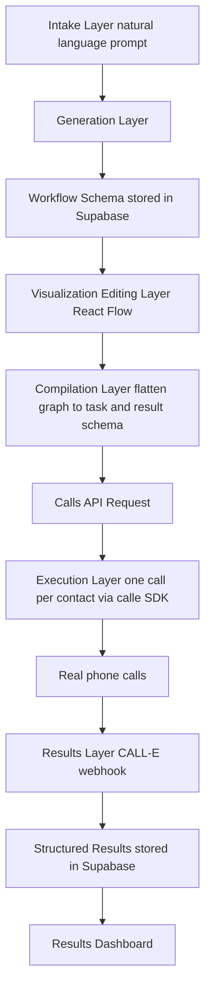

# TECHNICAL_ARCH.md

## Veyra: Technical Architecture and Implementation Details

This document is the detailed technical companion to CLAUDE.md and the project README. It
covers system design, data models, API contracts, and implementation specifics for every
layer of the application. Read this before implementing any new module, and update it
whenever a schema, route, or integration contract changes.

---

## 1. Package Manager

This project uses **pnpm**, not npm or yarn. Both teammates must have pnpm installed
locally.

```
pnpm install -g pnpm (not needed if already global)
verify with:
pnpm --version
```

Setup:

```
pnpm install
pnpm dev
```

Do not commit package-lock.json or yarn.lock. Only pnpm-lock.yaml should exist in the
repo. If either of you accidentally generates one, delete it and re-run pnpm install.

Common commands:

```
pnpm dev # start local dev server
pnpm build # production build
pnpm lint # lint check
pnpm test # run tests
pnpm add <package> # add a dependency
pnpm add -D <package> # add a dev dependency
```

---

## 2. High-Level System Overview

Veyra has five logical layers:

1. Intake layer: captures a natural language description of a calling process from the user
2. Generation layer: converts that description into a structured, machine readable workflow schema using the Claude API
3. Visualization/editing layer: renders the workflow schema as an interactive graph (React Flow) that a developer can inspect and modify
4. Compilation layer: flattens the internal workflow graph into a single CALL-E Calls API request (a natural-language `task` plus a `result_schema`)
5. Execution and results layer: dispatches one call per contact through CALL-E, receives structured call outcomes by webhook, and persists/displays them



---

## 3. Data Model

### 3.1 Workflow Schema (types/workflow.ts)

This is the central contract of the entire application. Every layer reads or writes this
shape.

This shape is what `types/workflow.ts` actually declares. Keep the two in step.

```ts
type NodeType = "start" | "question" | "decision" | "terminal";

interface WorkflowNode {
  id: string;          // unique within the workflow, e.g. "n1"
  type: NodeType;
  label: string;       // short purpose label, e.g. "Risk Tolerance"
  say: string;         // the prompt text the agent says at this step
  captures: string[];  // field names this node is expected to capture
  x: number;           // canvas position, graph coordinates
  y: number;
}

interface WorkflowEdge {
  id: string;
  from: string;              // node id
  to: string;                // node id
  condition: string | null;  // "Yes", "Qualified", ... or null for a plain sequential edge
}

interface QualificationRule {
  field: string;             // a field name appearing in some node's captures
  operator: "gte" | "lte" | "eq" | "in";
  value: string | number | string[];
  points: number;
}

interface Qualification {
  rules: QualificationRule[];
  threshold: number;         // total score at or above which the call counts as qualified
}

// Constrained to CALL-E's supported JSON Schema subset. See section 4.
type OutcomeFieldType = "string" | "number" | "integer" | "boolean" | "object" | "array";

interface OutcomeField {
  name: string;
  type: OutcomeFieldType;
  description?: string;
  enumValues?: string[];     // compiles to `enum`
  required?: boolean;
  items?: OutcomeField;      // simple array.items only, no tuples
  properties?: OutcomeField[]; // nested object fields
}

interface OutcomeSchema {
  fields: OutcomeField[];
  nextStep: string[];        // permitted values of the call's next-step disposition
}

interface Workflow {
  id: string;                // uuid, matches Supabase row id
  goal: string;              // one to two sentence summary of workflow purpose
  sourcePrompt?: string;     // the original natural language description
  nodes: WorkflowNode[];
  edges: WorkflowEdge[];
  qualification: Qualification;
  outcomeSchema: OutcomeSchema;
  createdAt?: string;
  updatedAt?: string;
}
```

### Design notes:

- nodes and edges are deliberately generic (graph shape) rather than a rigid linear
  sequence, since real workflows branch (consent no/yes, qualification qualified/not ready).
- The graph is Veyra's own authoring and editing abstraction. It is never sent to CALL-E as
  a graph, it is flattened at compile time into one `task` string plus a `result_schema`
  (section 4 and section 7).
- `captures` on a node links conversation nodes to outcomeSchema fields, this is how the
  compiler knows what data to ask CALL-E to extract.
- `OutcomeField` deliberately cannot express `$ref`, `oneOf`, `anyOf`, `allOf`, recursion,
  or `additionalProperties: true`, because CALL-E rejects all of them server side. Do not
  widen this type without reading section 4 first.
- Keep the qualification rules simple (rule based, not ML scored) for the hackathon
  timeline. A weighted scoring model is a stretch goal, not a requirement.

### 3.2 Campaign and Contact (types/campaign.ts)

```
interface Contact {
id: string;
name: string;
phoneNumber: string;
metadata?: Record<string, string>; arbitrary extra fields, e.g. "source": "web form"
}

interface Campaign {
id: string;
workflowId: string;
compiledRequest?: CalleCallRequest; the flattened Calls API request, once compiled (section 4)
name: string;
status: "draft" | "compiled" | "launched" | "completed";
contacts: Contact[];
createdAt: string;
launchedAt?: string;
}

interface CallResult {
id: string;
campaignId: string;
contactId: string;
calleCallId?: string; the CALL-E call id, once the call is created
qualified: boolean | null;
capturedData: Record<string, string | number | boolean> | null; null when structured_result is null
transcript?: string;
status: "pending" | "completed" | "failed" | "result_validation_failed";
failureCode?: string | null;
completedAt?: string;
}
```

### 3.3 Supabase Schema (supabase/schema.sql)

`supabase/schema.sql` is the real, runnable version of everything below, including the
profiles table, the signup trigger, and every RLS policy. Run it in the Supabase SQL
editor; it is idempotent and safe to re-run. The Authentication section below explains the
ownership model.

```
create table profiles (
id uuid primary key references auth.users(id) on delete cascade,
full_name text,
company_name text,
role text not null default 'business_user',
created_at timestamptz default now()
);

create table workflows (
id uuid primary key default gen_random_uuid(),
user_id uuid not null references auth.users(id) on delete cascade,
goal text not null,
source_prompt text not null,
schema jsonb not null, full Workflow object (nodes, edges, rules, outcomeSchema)
created_at timestamptz default now(),
updated_at timestamptz default now()
);

create table campaigns (
id uuid primary key default gen_random_uuid(),
user_id uuid not null references auth.users(id) on delete cascade,
workflow_id uuid references workflows(id),
compiled_request jsonb, the flattened Calls API request, once compiled
name text not null,
status text not null default 'draft',
created_at timestamptz default now(),
launched_at timestamptz
);

create table contacts (
id uuid primary key default gen_random_uuid(),
campaign_id uuid references campaigns(id),
name text not null,
phone_number text not null,
metadata jsonb
);

create table call_results (
id uuid primary key default gen_random_uuid(),
campaign_id uuid references campaigns(id),
contact_id uuid references contacts(id),
calle_call_id text,
qualified boolean,
captured_data jsonb, null is valid, see section 4 on structured_result
transcript text,
status text not null default 'pending',
failure_code text,
completed_at timestamptz
);

CALL-E webhook delivery is at-least-once, so every event id is recorded before any side
effect runs and re-deliveries are skipped on the primary key conflict.

create table processed_webhook_events (
event_id text primary key, the CALL-E-Event-Id / payload event id
event_type text not null,
processed_at timestamptz default now()
);

Rationale: storing schema and compiled_request as jsonb rather than fully normalizing
nodes/edges into their own tables keeps this fast to build and query for a hackathon
timeline. Normalize later if the project continues past the hackathon.
```

---

## Authentication

Email and password only. No password reset, no OAuth providers, no MFA, no email
verification — every one of those is a deliberate omission, not a gap to fill in later
without discussing it. This section is deliberately unnumbered so sections 4 to 13 keep
the numbers that CLAUDE.md and the rest of this document cross-reference.

### Identity lives in `auth.users`, not in a table we own

Supabase Auth already owns identity. Veyra does **not** create a users table. `profiles`
extends the auth row instead:

```
create table profiles (
id uuid primary key references auth.users(id) on delete cascade,
full_name text,
company_name text,
role text not null default 'business_user',
created_at timestamptz default now()
);
```

Because `profiles.id` *is* the auth user id, `id = auth.uid()` is a valid ownership check
with no join, and deleting an auth user cascades the profile away.

`workflows` and `campaigns` each carry `user_id uuid not null references auth.users(id) on
delete cascade` (section 3.3). `contacts` and `call_results` deliberately do not: their
owner is derived through the parent campaign, so there is one source of truth rather than a
duplicated column that can drift out of sync.

The runnable source of everything below is **`supabase/schema.sql`**. It is idempotent, so
re-running it after an edit is safe. It has to be executed by hand in the Supabase SQL
editor — none of it takes effect until then.

### Profile creation trigger

The signup form passes `full_name` and `company_name` through
`supabase.auth.signUp({ options: { data } })`, which lands in
`auth.users.raw_user_meta_data`. An `after insert on auth.users` trigger copies them into
`profiles`, so the app never needs a second round trip after signup:

```
create function public.handle_new_user() returns trigger
language plpgsql security definer set search_path = '' as $$
begin
  insert into public.profiles (id, full_name, company_name)
  values (new.id,
          nullif(trim(new.raw_user_meta_data ->> 'full_name'), ''),
          nullif(trim(new.raw_user_meta_data ->> 'company_name'), ''))
  on conflict (id) do nothing;
  return new;
end; $$;

create trigger on_auth_user_created after insert on auth.users
for each row execute function public.handle_new_user();
```

Two things about the shape of this function are load-bearing:

- **`role` is not read from metadata.** `raw_user_meta_data` is user-editable — a client
  can update it at any time — so anything read from it is effectively self-assigned. `role`
  takes the column default `'business_user'`. If Veyra ever grows real roles, they belong
  in `raw_app_meta_data` or an admin-only write path. Never put an authorization decision
  behind a `user_metadata` claim.
- **`security definer` with `set search_path = ''`.** The function must write to
  `public.profiles` as its owner, and an empty search path stops a caller-controlled schema
  from shadowing the objects it references.

### Row Level Security

RLS is enabled on every table in `public`, because `public` is exposed through the Data
API. It is the actual security boundary for user data — not the middleware, and not any
filter in application code.

- `profiles` — select, insert, update where `(select auth.uid()) = id`. No delete policy:
  removal happens through the cascade from `auth.users`, and letting a user delete their
  own profile while their auth user survives leaves a signed-in user with no name.
- `workflows`, `campaigns` — all four verbs where `(select auth.uid()) = user_id`.
- `contacts` — all four verbs, gated on `exists (select 1 from campaigns c where c.id =
  contacts.campaign_id and c.user_id = (select auth.uid()))`.
- `call_results` — **select only**, gated the same way through the parent campaign. Results
  are written by the CALL-E webhook under the service role; nothing in the browser should
  be able to forge or edit the recorded outcome of a real phone call.
- `processed_webhook_events` — RLS on, no policies, so only the service role reaches it.

Four conventions apply to every policy, and each one is a trap if ignored:

1. **`to authenticated`, never `auth.role() = 'authenticated'`.** The latter is deprecated
   and silently passes for anonymous sign-ins.
2. **`(select auth.uid())`, not bare `auth.uid()`.** The subselect is evaluated once per
   statement instead of once per row.
3. **`to authenticated` alone is authentication without authorization.** It checks the
   role, not the row. The ownership predicate in `using` is what actually scopes access.
4. **Every UPDATE policy carries both `using` and `with check`.** Without `with check` a
   user can reassign a row's `user_id` to somebody else. And an UPDATE has to SELECT the
   row first, so without a matching select policy it silently affects zero rows rather than
   erroring.

Tables created from raw SQL are not necessarily exposed to the Data API, so the schema also
grants the `authenticated` role explicitly. `anon` is granted nothing. Grants decide whether
a table is reachable at all; RLS decides which rows come back.

### Route protection

Next.js 16 renamed middleware to **`proxy.ts`**, which calls `updateSession` in
`lib/supabase/middleware.ts` — the `@supabase/ssr` pattern, unchanged apart from the guard.
`PROTECTED_PREFIXES` covers `/workflow`, `/campaign`, `/profile`, their plural forms, and
`/api/workflows`, `/api/campaigns`.

- Unauthenticated page request → redirect to `/auth/login?next=<original path>`, so login
  returns the user where they were going. The `next` value is validated before use: only a
  path starting with a single `/` is accepted, otherwise `//evil.com` turns login into an
  open redirect.
- Unauthenticated `/api/` request → `401 JSON`, because redirecting `fetch()` to an HTML
  login page yields a 200 full of markup rather than a status the caller can branch on.
- Authenticated user on `/auth/login` or `/auth/signup` → redirect to `/`.

**The middleware is a UX guard, not the security boundary.** It stops signed-out users
landing on empty screens. RLS is what makes data inaccessible, and it holds for requests
that never pass through the proxy at all.

Do not move the `getClaims()` call or the `supabaseResponse` return in that file, and do
not insert code between the client construction and `getClaims()` — doing so causes users to
be logged out at random, and it is very hard to debug after the fact.

### Application surface

| Path | Purpose |
| ---- | ------- |
| `supabase/schema.sql` | Tables, trigger, RLS policies, grants. Run by hand. |
| `lib/supabase/auth.ts` | `getSessionUser()` for server components; `requireUser()` for API routes. |
| `app/auth/actions.ts` | `login`, `signup`, `logout` server actions. |
| `app/auth/AuthForm.tsx` | Shared login/signup form shell. |
| `components/UserProvider.tsx` | `useUser()` context, plus `initialsFor()`. |
| `components/AccountIndicator.tsx` | Header account tile and log-out control. |
| `app/profile/page.tsx` | Account screen. Identity is real; the workflow cards are still sample data. |

`getSessionUser()` uses `supabase.auth.getUser()`, not `getSession()` — getSession reads the
cookie without verifying it and can be spoofed. The root layout resolves the user once and
passes it into `UserProvider`, so client components read it from context with no fetch and
no logged-out flash; the auth actions call `revalidatePath('/', 'layout')` to refresh it.

**The contract for API routes that touch user-owned data** (see also section 10):

```ts
const auth = await requireUser();
if (!auth.ok) return auth.response;
const { supabase, user } = auth;
```

- The client returned is the **user-scoped** one, so RLS enforces ownership on select,
  update and delete. An explicit `.eq('user_id', user.id)` is fine as defense in depth, but
  it is not what is doing the work.
- **Inserts must set `user_id: user.id` explicitly.** The insert policy checks that column,
  it does not populate it, so an insert without it fails the `with check`.
- Never substitute the service role client to make a query work. It bypasses RLS entirely
  and turns the route into a cross-tenant leak. The one legitimate service-role caller is
  the CALL-E webhook, which has no user session to work from.

### Project settings (manual, cannot be done from code)

**Authentication > Providers > Email > "Confirm email" must be turned OFF.** This is a
hackathon build demoed live: with confirmation on, `signUp` returns a user with no session
and the signup flow dead-ends waiting on an email nobody will click on stage. The `signup`
action detects the null session and returns an error naming this setting, so the failure is
self-explaining rather than a silent bounce back to the login screen.

---

## 4. CALL-E Integration Contract

This section is the single reference for CALL-E's real request and response shapes. Check
here rather than re-deriving from memory or re-reading the external docs.

### 4.1 Calls only, never Goals

Veyra only ever creates **Calls** (`POST /v1/calls`). It never creates, reads, or manages
**Goals**.

A Goal is CALL-E's term for a persisted, reusable voice workflow. Goals can only be
authored and published inside CALL-E's own Chat interface. The Developer API can only
list, read, and run Goals that a human already published there, it cannot create or
publish one. The installed SDK reflects this exactly: `client.goals` exposes `list`,
`get`, `run`, `getRun`, `waitForResult`, and `runAndWait`, and nothing that creates.

Since Veyra generates a new workflow per user prompt automatically, using Goals would
require a manual step in CALL-E's UI for every generated workflow, which defeats the point
of the product. The one-shot Calls API is the correct surface.

### 4.2 SDK install and client setup

```
pnpm add @call-e/calle
```

Server side only, inside `lib/calle-client.ts`:

```ts
import { CalleClient } from "@call-e/calle";

export const calle = new CalleClient({ apiKey: process.env.CALLE_API_KEY! });
```

Never import this module, or read `CALLE_API_KEY`, from client-side code. `CALLE_BASE_URL`
may be passed as `baseUrl` to override the default `https://api.heycall-e.com`.

Note the naming seam: the **wire API uses snake_case** (`result_schema`,
`recipient_result_schema`, `webhook_url`) while the **TypeScript SDK uses camelCase**
(`resultSchema`, `recipientResultSchema`, `webhookUrl`). This document uses the wire names;
`lib/calle-client.ts` is the only place the two spellings meet.

### 4.3 Request shape

```jsonc
{
  "task": "string",                   // required
  "recipient":  { "phones": ["+1..."] },   // single recipient
  "recipients": [ { "phones": ["+1..."] } ], // batch, see 4.4 for why we do not use it
  "result_schema": { },               // call-level structured output, see 4.5
  "recipient_result_schema": { },     // per-recipient output, only when batching
  "metadata": { "campaignId": "...", "contactId": "..." },
  "webhook_url": "https://.../api/calle/webhook"
}
```

Sent with an `Idempotency-Key` request header.

**`task`** is a coherent natural-language instruction rendered from the workflow's nodes
and edges, e.g. "Introduce yourself and the company. Ask permission to continue. If yes,
ask about financial goal (retirement, wealth growth, tax planning, education, other), then
investment horizon, then risk tolerance. If qualified, offer to book an advisor
consultation. If not ready, offer to send information." CALL-E does not execute an
external branching graph, it runs one adaptive conversation from this single instruction
and extracts structured data afterward, at the end of the call.

### 4.4 Why Veyra does not use `recipients`

The batch `recipients` array sends the **exact same task text** to multiple phone numbers
at once. It has no per-recipient variable substitution. Veyra's qualification calls are
personalized per contact, so the correct pattern is **one Calls API request per contact**,
with that contact's name and relevant metadata interpolated directly into their own `task`
string. See section 8.2.

`recipient_result_schema` is therefore unused today. It only becomes relevant if a future
feature batches genuinely identical-task calls.

### 4.5 Result schema constraints

CALL-E validates `result_schema` and `recipient_result_schema` server side against a
**subset** of JSON Schema. Anything outside the subset is rejected, or silently nulls out
the result.

Supported:

- `type` of `object`, `string`, `number`, `integer`, `boolean`, or `array`
- `properties`, `required`, `enum`
- nested object fields
- simple `array.items`
- `description`
- `additionalProperties: false`

Not supported, will be rejected:

- `$ref`
- `oneOf`, `anyOf`, `allOf`
- recursive schemas
- `additionalProperties: true`

`lib/validation.ts` enforces this before any request reaches CALL-E. Catching it at
compile time rather than at demo time is the whole point.

**Reserved recipient field names.** If `recipient_result_schema` is ever used, avoid
CALL-E's reserved recipient field names: `summary`, `status`, `transcript`, `call_id`, and
any timing-related field name (`started_at`, `completed_at`, `duration`, and similar).
This constraint is noted in `types/workflow.ts` next to `OutcomeField` so it is not
rediscovered the hard way.

### 4.6 Idempotency

Every call creation sends a stable `Idempotency-Key` derived from a durable business
identifier:

```
veyra_{campaignId}_{contactId}
```

Never a randomly generated UUID. This key is what lets a retry after a timeout safely
avoid placing a **duplicate real phone call**, and a fresh random key on every retry
defeats that entirely.

### 4.7 Metadata

Every call creation sends at minimum:

```jsonc
{ "campaignId": "...", "contactId": "..." }
```

This is the only mechanism that correlates an incoming webhook event back to the right
Supabase campaign and contact rows. CALL-E's terminal payload carries no other reference
to our internal ids.

### 4.8 Webhook contract

- `webhook_url` is set per call creation, pointing at `app/api/calle/webhook/route.ts`.
- Three terminal event types: `call.completed`, `call.failed`,
  `call.result_validation_failed`.
- **No signature, no secret.** CALL-E webhook deliveries are unsigned (the SDK's
  `webhooks.verify` / `webhooks.unwrap` helpers are deprecated and apply only to legacy
  signed deliveries). Validate the `CALL-E-Event-Id` header against the event id in the
  payload body, and otherwise treat this route as a public, untrusted-input boundary:
  validate everything, trust nothing, never echo payload content into a privileged path.
- **Delivery is at-least-once.** Store processed event ids in
  `processed_webhook_events` and skip any event id already present **before** running side
  effects, not after.
- **`structured_result: null` is a normal outcome**, documented by CALL-E for when it
  cannot extract a schema-valid result from the call. The UI and the Supabase write path
  must both treat it as an expected state, never as an error to crash on.

---

## 5. Generation Layer (lib/generator.ts)

### 5.1 Responsibility

Takes a natural language prompt and returns a Workflow object matching the schema in
section 3.1.

### 5.2 Implementation Approach

Call the Claude API (Anthropic) with a system prompt instructing it to:

1. Identify the goal of the calling process
2. Identify what information needs to be collected from the contact
3. Generate a sequence of conversation nodes, including branches (consent, qualification
   outcome, and any domain specific branches like risk tolerance tiers)
4. Generate qualification rules based on the information collected
5. Generate the outcome schema (what structured data the campaign should return)
6. Return only valid JSON matching the Workflow TypeScript type, no prose, no markdown fences

Pseudocode:

```
async function generateWorkflow(prompt: string): Promise<Workflow> {
const response = await anthropic.messages.create({
model: "claude-sonnet-4-6",
max_tokens: 2000,
system: WORKFLOW_GENERATION_SYSTEM_PROMPT, includes schema definition + examples
messages: [{ role: "user", content: prompt }],
});

const raw = extractTextContent(response);
const parsed = JSON.parse(stripCodeFences(raw));
return validateWorkflowSchema(parsed); zod validation, throws if malformed
}
```

### 5.3 Validation (lib/validation.ts)

Use zod to define a schema mirroring the Workflow type and validate every generation
result before it is stored or passed downstream. If validation fails, retry once with an
error correction message appended to the prompt before surfacing an error to the user.

`lib/validation.ts` also owns enforcement of CALL-E's supported JSON Schema subset
(section 4.5). `assertCalleSchemaSubset()` runs over any compiled `result_schema` or
`recipient_result_schema` and throws on `$ref`, `oneOf`, `anyOf`, `allOf`, an unsupported
`type`, or `additionalProperties: true`. Nothing reaches the Calls API without passing it.
Because the generator writes the outcome schema, it is the most likely source of an
unsupported construct, so the generator system prompt must state the subset explicitly as
well.

### 5.4 Handling Ambiguous Prompts

Decision for the hackathon: default to sensible assumptions rather than a multi turn
clarification flow, to keep the demo fast and self contained. Document any defaulting
behavior (e.g. "if no escalation path is described, default to a single qualified/not
ready branch") directly in the system prompt and in this file, so both teammates know the
behavior without re-reading generator code.

---

## 6. Visualization and Editing Layer (components/WorkflowGraph.tsx)

### 6.1 Responsibility

Render a Workflow object as an interactive graph, and allow node/edge edits that write
back to the schema.

### 6.2 Implementation Approach

- Use React Flow. Map each WorkflowNode to a React Flow node, each WorkflowEdge to a React
  Flow edge, with condition rendered as an edge label where present.
- Layout: use a simple top to bottom auto layout (e.g. dagre or a manual layered layout
  based on graph depth from the start node) since hand-positioning nodes is not worth the
  time for a hackathon.
- Editing: clicking a node opens NodeEditor.tsx, a side panel with fields for label,
  purpose, prompt text, and captureField. Saving updates the node in local state, then
  persists via PATCH /api/workflows/[id].
- Adding a node: a simple "add node after this one" action on each node, which creates a
  new node and edge, then opens it in the editor immediately.
- NodeTable.tsx renders the same data as a table (Node / Purpose columns) alongside or
  instead of the graph, useful for the README-style presentation and for quick scanning
  during the demo.

### 6.3 State Management

Keep this simple: local React state for the workflow being edited, with an explicit "Save"
action that calls PATCH /api/workflows/[id] rather than auto-saving on every keystroke.
This avoids race conditions and is easier to demo reliably.

---

## 7. Compilation Layer (lib/compiler.ts)

### 7.1 Responsibility

Flatten the internal Workflow graph into a single CALL-E Calls API request. The compiler
does **not** translate nodes and edges into a state machine config, and does not create or
publish anything on CALL-E's side.

CALL-E does not execute an external branching graph. It runs one adaptive conversation
from a single task instruction and extracts structured data afterward, at the end of the
call. The graph is Veyra's own authoring and editing abstraction, and it gets flattened
here.

### 7.2 Implementation Approach

```ts
interface CalleCallRequest {
  task: string;                          // rendered from nodes + edges
  result_schema: object;                 // derived from Workflow.outcomeSchema
  recipient_result_schema?: object;      // only if ever batching identical-task calls
  metadata: { campaignId: string; contactId: string };
  webhook_url: string;
}

function compileWorkflow(
  workflow: Workflow,
  context: { campaignId: string; contact: Contact },
): CalleCallRequest {
  // 1. Walk nodes in graph order and render each `say` as an instruction sentence.
  // 2. Render each conditional edge as an "if ... then ..." clause, so branching survives
  //    as natural language rather than as structure.
  // 3. Fold the qualification rules and threshold into a plain-language qualification
  //    instruction. Scoring itself is re-evaluated our side from the returned fields.
  // 4. Interpolate the contact's name and metadata into the task (see 4.4).
  // 5. Derive result_schema from workflow.outcomeSchema, then run
  //    assertCalleSchemaSubset() over it (see 4.5).
  // 6. Attach metadata and webhook_url.
}
```

The rendered `task` should read as a coherent brief to a human caller, not as a serialized
graph. A worked example lives in the README's "What this compiles into" section.

The `Idempotency-Key` is **not** part of this payload, it is a request header applied at
dispatch time in section 8.2, since it depends on the contact being dialled.

### 7.3 Testing Strategy

Before testing against generated workflows, hand write one minimal workflow (2 to 3 nodes,
one branch) and confirm it compiles into a valid request and runs correctly against CALL-E
on a **single** contact. This isolates compiler bugs from generator bugs, and there is no
cancel operation once calls are created (section 13), so a malformed task dispatched to a
list cannot be recalled. Only after that passes, test full generator to compiler to
execution end to end.

### 7.4 Credential Handling

All CALL-E credentials live server side only (`CALLE_API_KEY` in .env.local), compilation
happens exclusively in the POST /api/workflows/[id]/compile API route, never client side.

---

## 8. Execution and Results Layer

### 8.1 Responsibility

Launch a campaign (a workflow config plus a contact list) through CALL-E, and capture
structured results as calls complete.

### 8.2 Launch Flow (app/api/campaigns/[id]/launch/route.ts)

**One Calls API request per contact**, each with that contact's details interpolated into
their own task string. Not CALL-E's batch `recipients` array, which sends identical text to
every number with no per-recipient substitution (section 4.4).

```ts
async function launchCampaign(campaignId: string) {
  const campaign = await getCampaign(campaignId);
  const workflow = await getWorkflow(campaign.workflowId);

  for (const contact of campaign.contacts) {
    const request = compileWorkflow(workflow, { campaignId, contact });

    await calle.calls.create(
      {
        task: request.task,                       // personalized for this contact
        recipient: { phones: [contact.phoneNumber] },
        resultSchema: request.result_schema,
        metadata: { campaignId, contactId: contact.id },
        webhookUrl: `${process.env.APP_URL}/api/calle/webhook`,
      },
      { idempotencyKey: `veyra_${campaignId}_${contact.id}` },
    );
  }

  await updateCampaignStatus(campaignId, "launched");
}
```

Three things are mandatory on every iteration, and all three are easy to drop:

1. `idempotencyKey` of `veyra_{campaignId}_{contactId}`, stable across retries (section 4.6)
2. `metadata` carrying `campaignId` and `contactId` (section 4.7)
3. `webhookUrl` (section 4.8)

**Optional enhancement, not MVP:** CALL-E documents a wave-based dispatch pattern for
workflows that only need a target number of confirmations rather than calling every
contact. Worth a mention in the Campaign Builder UI if time allows, but do not build it
for the hackathon, and note that the lack of a cancel operation makes small waves a
sensible safety habit regardless (section 13).

### 8.3 Results Capture (app/api/calle/webhook/route.ts)

**Webhooks. Confirmed, not a choice.** The earlier "webhook vs polling" question is
settled: CALL-E posts terminal events to the `webhook_url` set on each call creation. Full
contract in section 4.8.

Handler order matters:

```ts
export async function POST(req: NextRequest) {
  const raw = await req.text();
  const event = JSON.parse(raw);              // untrusted input, validate everything

  // 1. Unsigned deliveries: cross-check the header against the body.
  if (req.headers.get("CALL-E-Event-Id") !== event.id) {
    return NextResponse.json({ error: "event id mismatch" }, { status: 400 });
  }

  // 2. At-least-once delivery: claim the event id BEFORE any side effect.
  const claimed = await claimEventId(event.id, event.type); // insert, false on conflict
  if (!claimed) return NextResponse.json({ ok: true });     // already processed

  // 3. Three terminal event types.
  switch (event.type) {
    case "call.completed":
      // structured_result may be null. That is normal, not an error.
      await writeCallResult(event.data, { qualified: null, capturedData: null });
      break;
    case "call.failed":
      await markCallFailed(event.data);
      break;
    case "call.result_validation_failed":
      // CALL-E could not produce a schema-valid result; keep the transcript, flag the row.
      await markResultValidationFailed(event.data);
      break;
    default:
      return NextResponse.json({ ok: true });  // unknown type, acknowledge and ignore
  }

  return NextResponse.json({ ok: true });      // any 2xx counts as delivered
}
```

The campaign and contact rows are matched through `event.data.metadata.campaignId` and
`.contactId`, which is the only correlation mechanism available (section 4.7).

`structured_result: null` must flow through to Supabase as a null `captured_data` and
render in the dashboard as "no result extracted", never as a crash or a blank error state.

### 8.4 Budget Management

Given the 20 free call limit per account, and the ability to request more:

- Use CALL-E test/sandbox modes if available during development
- Reserve a minimum of 3 to 5 real calls specifically for the final demo recording
- Request additional call credits early if the team anticipates needing more than the
  default allocation, do not wait until the final day

---

## 9. Results Dashboard (components/ResultsDashboard.tsx)

Simple table view per campaign, columns: Contact, Status, Qualified, Captured Data,
Transcript.

Pull data from GET /api/campaigns/[id]/results, which reads call_results rows for the
campaign from Supabase. No pagination or filtering needed for the hackathon scope, a flat
table is sufficient.

Render a null `captured_data` as an explicit "no result extracted" state, and a
`result_validation_failed` status as its own row state. Both are normal, documented CALL-E
outcomes (section 4.8), and the dashboard is on camera during the demo.

---

## 10. API Route Summary

/api/workflows/generate POST prompt -> generated Workflow, stores in Supabase
/api/workflows/[id] GET fetch a workflow by id
/api/workflows/[id] PATCH update a workflow (from the editor)
/api/workflows/[id]/compile POST Workflow -> Calls API request (task + result_schema), stores in campaign
/api/campaigns POST create a campaign from a compiled workflow + contacts
/api/campaigns/[id]/launch POST create one idempotent CALL-E call per contact in the campaign
/api/campaigns/[id]/results GET fetch structured call results for a campaign
/api/calle/webhook POST receive terminal call events from CALL-E (public, unsigned, deduplicated)

Every route above except the webhook requires an authenticated user and must open with
`requireUser()` from `lib/supabase/auth.ts`. Inserts set `user_id` explicitly; reads,
updates and deletes are scoped by RLS. The webhook is the sole exception: it has no user
session, runs under the service role, and is a public untrusted-input boundary. See the
Authentication section.

---

## 11. Environment Variables

ANTHROPIC_API_KEY=
CALLE_API_KEY=
CALLE_BASE_URL=          # optional, defaults to https://api.heycall-e.com
APP_URL=                 # public base URL used to build webhook_url
NEXT_PUBLIC_SUPABASE_URL=
SUPABASE_SERVICE_ROLE_KEY=          # bypasses RLS, webhook route only
NEXT_PUBLIC_SUPABASE_PUBLISHABLE_KEY=

The browser key is `NEXT_PUBLIC_SUPABASE_PUBLISHABLE_KEY`, not `..._ANON_KEY` — that is
what `lib/supabase/{client,server,middleware}.ts` read, and it is Supabase's current name
for the key. Legacy `anon` keys still work but are kept only for compatibility.

Two Supabase settings are not environment variables and cannot be set from code: "Confirm
email" must be OFF under Authentication > Providers > Email, and `supabase/schema.sql` must
be run in the SQL editor. See the Authentication section.

`.env.example` is committed and lists every variable with no values. Copy it:

```
cp .env.example .env.local
```

`.env.local` is gitignored (`.gitignore` negates `.env*` for `.env.example` only). Both
teammates need their own copy locally, share values through a secure channel, not through
the repo or chat history. Any new variable goes into `.env.example` in the same commit
that introduces it.

---

## 12. Build Order (maps to roadmap phases)

1. Scaffold Next.js + pnpm + Tailwind + Supabase connection
2. Define and lock types/workflow.ts (section 3.1), write 2 to 3 hand written example
   workflows to validate the schema before automating generation
3. Build generation layer, test against hand written examples for consistency
4. Build visualization/editing layer against generator output
5. Build compilation layer (graph -> task + result_schema), test against one hand written minimal workflow and a single contact first
6. Build campaign builder and launch flow (one idempotent call per contact)
7. Build webhook results capture, with event deduplication, and the dashboard
8. Run a second vertical prompt through the full pipeline to prove generality
9. Polish, record demo, submit

---

## 13. Known Risks

| Risk | Impact | Mitigation |
| ---- | ------ | ---------- |
| No cancel operation exists once a call is created. A bad or malformed task dispatched to many contacts cannot be aborted mid-flight. | High. Burns limited call credits and places real, wrong phone calls that cannot be recalled. | Test every task change against a single contact first. Dispatch in small waves rather than the full contact list at once, especially before the final demo recording. |
| `structured_result` can be null when CALL-E cannot extract a schema-valid answer from the call. | Medium. Crashes or blank states in the results dashboard, on camera. | Treat null as a normal, expected state in both the Supabase write path and the UI. Render it as "no result extracted". Covered in sections 4.8, 8.3 and 9. |
| 20 free call credits per account, and real calls cost credits to test. | Medium. Running out mid-build, or during the demo recording. | Mock CALL-E responses during UI work. Reserve 3 to 5 real calls for the recording. Request more credits early (section 8.4). |
| The generator can emit an outcome schema using unsupported JSON Schema features. | Medium. CALL-E rejects the request, or silently nulls the result, and it surfaces at demo time. | State the supported subset explicitly in the generator system prompt, and enforce it in `lib/validation.ts` before dispatch (sections 4.5, 5.3). |

---

## Architecture Reference

Full technical architecture, data models, API contracts, and build order live in
TECHNICAL_ARCH.md. Read it before implementing or modifying:

- the Workflow schema (types/workflow.ts) - see TECHNICAL_ARCH.md section 3.1
- any generator, visualizer, or compiler code - see sections 5, 6, 7
- anything touching CALL-E (client, compiler, launch, webhook) - see section 4
- API routes - see section 10 for the full route summary
- database schema - see section 3.3

If a task involves a technical decision not yet documented in TECHNICAL_ARCH.md (e.g. a new
CALL-E API detail, a schema field addition, a new route), update TECHNICAL_ARCH.md as part
of that task, do not leave the decision undocumented. Flag the update in your response so
the team is aware a decision was recorded.
