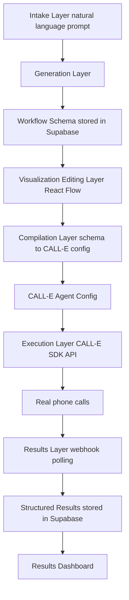

# ARCHITECTURE.md

## Veyra: Technical Architecture and Implementation Details

This document is the detailed technical companion to CLAUDE.md and the project README. It
covers system design, data models, API contracts, and implementation specifics for every
layer of the application. Read this before implementing any new module, and update it
whenever a schema, route, or integration contract changes.

---

## 1. Package Manager

This project uses **pnpm**, not npm or yarn. Both teammates must have pnpm installed
locally.

```
pnpm install -g pnpm (not needed if already global)
verify with:
pnpm --version
```

Setup:

```
pnpm install
pnpm dev
```

Do not commit package-lock.json or yarn.lock. Only pnpm-lock.yaml should exist in the
repo. If either of you accidentally generates one, delete it and re-run pnpm install.

Common commands:

```
pnpm dev # start local dev server
pnpm build # production build
pnpm lint # lint check
pnpm test # run tests
pnpm add <package> # add a dependency
pnpm add -D <package> # add a dev dependency
```

---

## 2. High-Level System Overview

Veyra has five logical layers:

1. Intake layer: captures a natural language description of a calling process from the user
2. Generation layer: converts that description into a structured, machine readable workflow schema using the Claude API
3. Visualization/editing layer: renders the workflow schema as an interactive graph (React Flow) that a developer can inspect and modify
4. Compilation layer: translates the internal workflow schema into a CALL-E native agent configuration
5. Execution and results layer: launches campaigns through CALL-E, receives structured call outcomes, and persists/displays them



---

## 3. Data Model

### 3.1 Workflow Schema (types/workflow.ts)

This is the central contract of the entire application. Every layer reads or writes this
shape.

```
type NodeType = "statement" | "question" | "branch" | "terminal";
```

```
interface WorkflowNode {
id: string; unique within the workflow, e.g. "n1"
type: NodeType;
label: string; short human readable name, e.g. "Risk Tolerance"
purpose: string; one line description, shown in NodeTable
prompt: string; the actual thing the voice agent says/asks at this node
captureField?: string; if this node captures data, the field name in outcomeSchema
}
```

```
interface WorkflowEdge {
id: string;
source: string; node id
target: string; node id
condition?: string; e.g. "yes", "no", "qualified", "not_ready", or undefined for a plain sequential edge
}
```

```

interface QualificationRule {
field: string; which captured field this rule evaluates
operator: "equals" | "in" | "greaterThan" | "lessThan";
value: string | number | string[];
weight?: number; optional scoring weight if using a scored model
}
```

```
interface OutcomeField {
name: string;
type: "string" | "boolean" | "number" | "enum";
enumValues?: string[];
}
```

```
interface Workflow {
id: string; uuid, matches Supabase row id
goal: string; one to two sentence summary of workflow purpose
sourcePrompt: string; the original natural language description
nodes: WorkflowNode[];
edges: WorkflowEdge[];
qualificationRules: QualificationRule[];
outcomeSchema: OutcomeField[];
createdAt: string;
updatedAt: string;
}
```

### Design notes:

- nodes and edges are deliberately generic (graph shape) rather than a rigid linear
  sequence, since real workflows branch (consent no/yes, qualification qualified/not ready).
- captureField on a node links conversation nodes to outcomeSchema fields, this is how the
  compiler knows what data to extract from CALL-E's structured output.
- Keep qualificationRules simple (rule based, not ML scored) for the hackathon timeline. A
  weighted scoring model is a stretch goal, not a requirement.

### 3.2 Campaign and Contact (types/campaign.ts)

```
interface Contact {
id: string;
name: string;
phoneNumber: string;
metadata?: Record<string, string>; arbitrary extra fields, e.g. "source": "web form"
}

interface Campaign {
id: string;
workflowId: string;
compiledConfigId?: string; reference to the compiled CALL-E config, once compiled
name: string;
status: "draft" | "compiled" | "launched" | "completed";
contacts: Contact[];
createdAt: string;
launchedAt?: string;
}

interface CallResult {
id: string;
campaignId: string;
contactId: string;
qualified: boolean | null;
capturedData: Record<string, string | number | boolean>;
transcript?: string;
status: "pending" | "completed" | "failed" | "no_answer";
completedAt?: string;
}
```

### 3.3 Supabase Schema (supabase/schema.sql)

```
create table workflows (
id uuid primary key default gen_random_uuid(),
goal text not null,
source_prompt text not null,
schema jsonb not null, full Workflow object (nodes, edges, rules, outcomeSchema)
created_at timestamptz default now(),
updated_at timestamptz default now()
);

create table campaigns (
id uuid primary key default gen_random_uuid(),
workflow_id uuid references workflows(id),
compiled_config jsonb, CALL-E agent config, once compiled
name text not null,
status text not null default 'draft',
created_at timestamptz default now(),
launched_at timestamptz
);

create table contacts (
id uuid primary key default gen_random_uuid(),
campaign_id uuid references campaigns(id),
name text not null,
phone_number text not null,
metadata jsonb
);

create table call_results (
id uuid primary key default gen_random_uuid(),
campaign_id uuid references campaigns(id),
contact_id uuid references contacts(id),
qualified boolean,
captured_data jsonb,
transcript text,
status text not null default 'pending',
completed_at timestamptz
);

Rationale: storing schema and compiled_config as jsonb rather than fully normalizing
nodes/edges into their own tables keeps this fast to build and query for a hackathon
timeline. Normalize later if the project continues past the hackathon.
```

---

## 5. Generation Layer (lib/generator.ts)

### 5.1 Responsibility

Takes a natural language prompt and returns a Workflow object matching the schema in
section 4.1.

### 5.2 Implementation Approach

Call the Claude API (Anthropic) with a system prompt instructing it to:

1. Identify the goal of the calling process
2. Identify what information needs to be collected from the contact
3. Generate a sequence of conversation nodes, including branches (consent, qualification
   outcome, and any domain specific branches like risk tolerance tiers)
4. Generate qualification rules based on the information collected
5. Generate the outcome schema (what structured data the campaign should return)
6. Return only valid JSON matching the Workflow TypeScript type, no prose, no markdown fences

Pseudocode:

```
async function generateWorkflow(prompt: string): Promise<Workflow> {
const response = await anthropic.messages.create({
model: "claude-sonnet-4-6",
max_tokens: 2000,
system: WORKFLOW_GENERATION_SYSTEM_PROMPT, includes schema definition + examples
messages: [{ role: "user", content: prompt }],
});

const raw = extractTextContent(response);
const parsed = JSON.parse(stripCodeFences(raw));
return validateWorkflowSchema(parsed); zod validation, throws if malformed
}
```

### 5.3 Validation (lib/validation.ts)

Use zod to define a schema mirroring the Workflow type and validate every generation
result before it is stored or passed downstream. If validation fails, retry once with an
error correction message appended to the prompt before surfacing an error to the user.

### 5.4 Handling Ambiguous Prompts

Decision for the hackathon: default to sensible assumptions rather than a multi turn
clarification flow, to keep the demo fast and self contained. Document any defaulting
behavior (e.g. "if no escalation path is described, default to a single qualified/not
ready branch") directly in the system prompt and in this file, so both teammates know the
behavior without re-reading generator code.

---

## 6. Visualization and Editing Layer (components/WorkflowGraph.tsx)

### 6.1 Responsibility

Render a Workflow object as an interactive graph, and allow node/edge edits that write
back to the schema.

### 6.2 Implementation Approach

- Use React Flow. Map each WorkflowNode to a React Flow node, each WorkflowEdge to a React
  Flow edge, with condition rendered as an edge label where present.
- Layout: use a simple top to bottom auto layout (e.g. dagre or a manual layered layout
  based on graph depth from the start node) since hand-positioning nodes is not worth the
  time for a hackathon.
- Editing: clicking a node opens NodeEditor.tsx, a side panel with fields for label,
  purpose, prompt text, and captureField. Saving updates the node in local state, then
  persists via PATCH /api/workflows/[id].
- Adding a node: a simple "add node after this one" action on each node, which creates a
  new node and edge, then opens it in the editor immediately.
- NodeTable.tsx renders the same data as a table (Node / Purpose columns) alongside or
  instead of the graph, useful for the README-style presentation and for quick scanning
  during the demo.

### 6.3 State Management

Keep this simple: local React state for the workflow being edited, with an explicit "Save"
action that calls PATCH /api/workflows/[id] rather than auto-saving on every keystroke.
This avoids race conditions and is easier to demo reliably.

---

## 7. Compilation Layer (lib/compiler.ts)

### 7.1 Responsibility

Translate the internal Workflow schema into whatever configuration format CALL-E's
SDK/API expects for defining an agent's conversation logic.

### 7.2 Implementation Approach

This is the piece most dependent on CALL-E's actual API surface, confirm exact method
names, config shape, and constraints against their integration guide before finalizing.
General shape:

async function compileWorkflow(workflow: Workflow): Promise<CalleAgentConfig> {
Map each WorkflowNode -> a CALL-E conversation state/prompt
Map each WorkflowEdge -> a CALL-E transition/branch condition
Map qualificationRules -> CALL-E's structured output / scoring mechanism if supported,
otherwise implement scoring logic in our own webhook handler post-call
Map outcomeSchema -> the structured data fields CALL-E should extract/return per call

const calleConfig: CalleAgentConfig = {
shape determined by CALL-E SDK/API, fill in once confirmed
};

return calleConfig;
}

### 7.3 Testing Strategy

Before testing against generated workflows, hand write one minimal workflow (2 to 3 nodes,
one branch) and confirm it compiles and runs correctly against CALL-E. This isolates
compiler bugs from generator bugs. Only after that passes, test full generator to compiler
to execution end to end.

### 7.4 Credential Handling

All CALL-E credentials live server side only (CALLE_API_KEY in .env.local), compilation
happens exclusively in the POST /api/workflows/[id]/compile API route, never client side.

---

## 8. Execution and Results Layer

### 8.1 Responsibility

Launch a campaign (a workflow config plus a contact list) through CALL-E, and capture
structured results as calls complete.

### 8.2 Launch Flow (app/api/campaigns/[id]/launch/route.ts)

async function launchCampaign(campaignId: string) {
const campaign = await getCampaign(campaignId);
const config = campaign.compiledConfig;

for (const contact of campaign.contacts) {
await calleClient.placeCall({
agentConfig: config,
phoneNumber: contact.phoneNumber,
metadata: { campaignId, contactId: contact.id },
});
}

await updateCampaignStatus(campaignId, "launched");
}

Confirm with CALL-E's docs whether calls are placed individually per contact or as a
batch/swarm operation, and whether there is a rate limit to respect given the free tier
call budget (20 calls).

### 8.3 Results Capture

Two possible mechanisms, confirm which CALL-E supports and document the final choice here:

Option A: Webhook (preferred if supported)
app/api/calle/webhook/route.ts receives a POST from CALL-E when a call completes,
containing the structured output. Parse it, match it to the corresponding
campaignId/contactId via the metadata passed at launch time, and write a CallResult row to
Supabase.

Option B: Polling
If no webhook is available, poll CALL-E's call status endpoint on an interval (e.g. every
10 to 15 seconds) for calls in a "pending" state, and update CallResult rows as statuses
change. Only use this if webhooks are not available, since it is less reliable and burns
more API calls.

### 8.4 Budget Management

Given the 20 free call limit per account, and the ability to request more:

- Use CALL-E test/sandbox modes if available during development
- Reserve a minimum of 3 to 5 real calls specifically for the final demo recording
- Request additional call credits early if the team anticipates needing more than the
  default allocation, do not wait until the final day

---

## 9. Results Dashboard (components/ResultsDashboard.tsx)

Simple table view per campaign, columns: Contact, Status, Qualified, Captured Data,
Transcript.

Pull data from GET /api/campaigns/[id]/results, which reads call_results rows for the
campaign from Supabase. No pagination or filtering needed for the hackathon scope, a flat
table is sufficient.

---

## 10. API Route Summary

/api/workflows/generate POST prompt -> generated Workflow, stores in Supabase
/api/workflows/[id] GET fetch a workflow by id
/api/workflows/[id] PATCH update a workflow (from the editor)
/api/workflows/[id]/compile POST Workflow -> CalleAgentConfig, stores in campaign
/api/campaigns POST create a campaign from a compiled workflow + contacts
/api/campaigns/[id]/launch POST trigger CALL-E calls for all contacts in campaign
/api/campaigns/[id]/results GET fetch structured call results for a campaign
/api/calle/webhook POST receive call outcome callbacks from CALL-E

---

## 11. Environment Variables

ANTHROPIC_API_KEY=
CALLE_API_KEY=
NEXT_PUBLIC_SUPABASE_URL=
SUPABASE_SERVICE_ROLE_KEY=
NEXT_PUBLIC_SUPABASE_ANON_KEY=

.env.local is gitignored. Both teammates need their own copy locally, share values through
a secure channel, not through the repo or chat history.

---

## 12. Build Order (maps to roadmap phases)

1. Scaffold Next.js + pnpm + Tailwind + Supabase connection
2. Define and lock types/workflow.ts (section 4.1), write 2 to 3 hand written example
   workflows to validate the schema before automating generation
3. Build generation layer, test against hand written examples for consistency
4. Build visualization/editing layer against generator output
5. Build compilation layer, test against one hand written minimal workflow first
6. Build campaign builder and launch flow
7. Build results capture (webhook or polling) and dashboard
8. Run a second vertical prompt through the full pipeline to prove generality
9. Polish, record demo, submit

---

## Architecture Reference

Full technical architecture, data models, API contracts, and build order live in
ARCHITECTURE.md. Read it before implementing or modifying:

- the Workflow schema (types/workflow.ts) - see ARCHITECTURE.md section 4.1
- any generator, visualizer, or compiler code - see sections 5, 6, 7
- API routes - see section 10 for the full route summary
- database schema - see section 4.3

If a task involves a technical decision not yet documented in ARCHITECTURE.md (e.g. a new
CALL-E API detail, a schema field addition, a new route), update ARCHITECTURE.md as part
of that task, do not leave the decision undocumented. Flag the update in your response so
the team is aware a decision was recorded.
